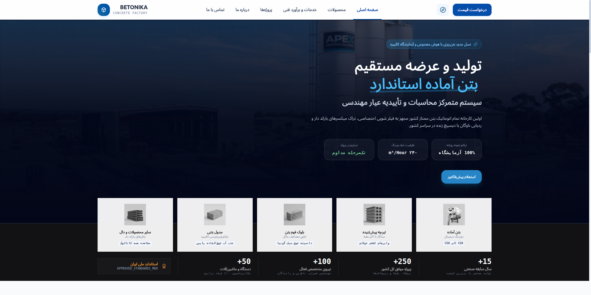
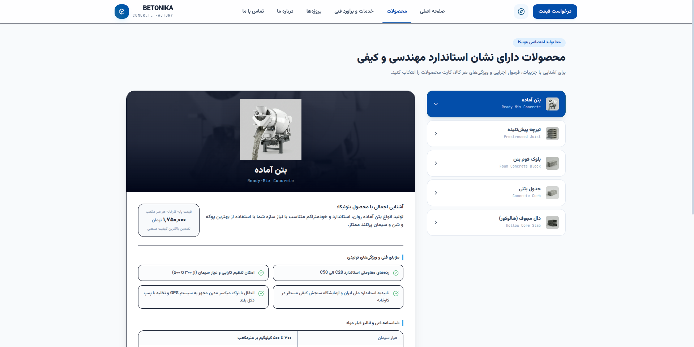
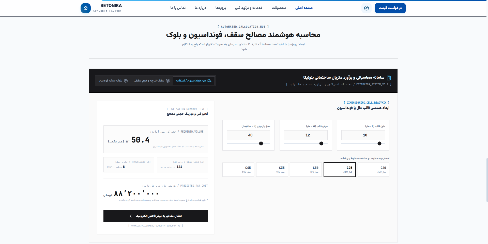
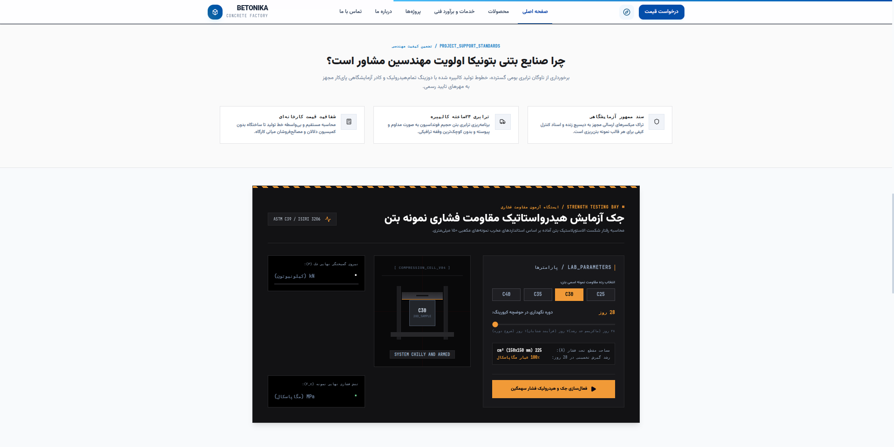

# بتونیکا (BETONIKA)

سایت رسمی کارخانجات بتن آماده، تیرچه پیش‌تنیده و بلوک فوم بتن **بتونیکا** — یک وب‌اپلیکیشن تمام‌عیار با رابط کاربری فارسی (RTL)، ابزارهای برآورد فنی، سامانه استعلام قیمت و مشاور هوشمند مبتنی بر هوش مصنوعی.

**[مشاهده دمو زنده](https://code1sprint.github.io/Betonika/)**

---

## نمای کلی

بتونیکا یک پلتفرم دیجیتال صنعتی برای معرفی محصولات بتنی، محاسبه آنلاین مصالح ساختمانی، ثبت درخواست پیش‌فاکتور و مشاوره فنی به مهندسان عمران و پیمانکاران است. طراحی رابط کاربری با الهام از زیبایی‌شناسی صنعتی-مدرن (Industrial Minimalism) انجام شده و تجربه‌ای حرفه‌ای برای مخاطبان فنی فراهم می‌کند.

---

## اسکرین‌شات‌ها

### صفحه اصلی — Hero و معرفی محصولات



صفحه فرود با پس‌زمینه کارخانه صنعتی، معرفی خط تولید، کارت‌های پنج‌گانه محصولات (بتن آماده، تیرچه پیش‌تنیده، بلوک فوم بتن، جدول بتنی، دال مجوف) و نوار آمار کلیدی شرکت.

### صفحه محصولات — کاتالوگ فنی



نمایش جزئیات هر محصول شامل توضیحات، قیمت پایه کارخانه، مزایای فنی، جدول مشخصات و دکمه‌های اقدام (برآورد متراژ / دریافت فاکتور).

### سامانه محاسبه هوشمند مصالح



ابزار تعاملی برآورد حجم بتن فونداسیون، سقف تیرچه-فوم و بلوک دیوار با اسلایدر ابعاد، انتخاب عیار بتن، تخمین وزن مرده، تعداد تراک میکسر و هزینه تقریبی — با امکان انتقال مستقیم به پیش‌فاکتور.

### شبیه‌ساز آزمایشگاه و تضمین کیفیت



بخش تضمین کیفیت مهندسی و شبیه‌ساز تعاملی تست مقاومت فشاری بتن (ASTM C39 / ISIRI 3206) با انتخاب رده بتن، دوره کیورینگ و محاسبه تنش فشاری.

---

## ویژگی‌های کلیدی

| بخش | توضیح |
|-----|-------|
| **صفحه اصلی** | Hero با افکت Parallax، کارت‌های محصول، آمار شرکت، نوار پیشرفت اسکرول |
| **محصولات** | کاتالوگ ۵ محصول با مشخصات فنی، قیمت و ویژگی‌های تولیدی |
| **مشاور هوشمند AI** | چت‌بات فنی مبتنی بر Gemini برای پاسخ به سوالات مهندسی عمران |
| **محاسبه‌گر مصالح** | برآورد بتن، تیرچه و بلوک با فرمول‌های مهندسی و قیمت‌گذاری لحظه‌ای |
| **پرتال پیش‌فاکتور** | ثبت درخواست قیمت، پیگیری وضعیت و اتصال به محاسبه‌گر |
| **پروژه‌ها** | گالری پروژه‌های انجام‌شده و در حال اجرا |
| **درباره ما / تماس** | معرفی شرکت، فرم تماس و اطلاعات ارتباطی |
| **ابزارهای تعاملی** | گردش کار بچینگ، شبیه‌ساز آزمایشگاه، FAQ فنی |
| **راهنمای سریع** | پنل کشویی (Drawer) با اطلاعات تماس و استانداردها |

---

## فناوری‌های استفاده‌شده

### فرانت‌اند
- **React 19** — رابط کاربری کامپوننت‌محور
- **TypeScript** — تایپ‌گذاری ایمن
- **Vite 6** — بیلد و توسعه سریع
- **Tailwind CSS 4** — استایل‌دهی Utility-first
- **Motion** — انیمیشن‌ها و ترنزیشن‌ها
- **Lucide React** — آیکون‌ها

### بک‌اند
- **Express.js** — سرور Node.js
- **Google Gemini API** (`@google/genai`) — مشاور هوشمند فنی
- **esbuild** — باندل سرور برای پروداکشن

### استقرار
- **GitHub Actions** — CI/CD خودکار
- **GitHub Pages** — هاست استاتیک فرانت‌اند

---

## ساختار پروژه

```
Betonika/
├── .github/workflows/
│   └── deploy-pages.yml      # استقرار خودکار روی GitHub Pages
├── src/
│   ├── assets/images/        # تصاویر محصولات و اسکرین‌شات‌ها
│   ├── components/
│   │   ├── AiConsultant.tsx          # مشاور هوشمند AI
│   │   ├── MaterialCalculator.tsx    # محاسبه‌گر مصالح
│   │   ├── QuotationPortal.tsx       # پرتال پیش‌فاکتور
│   │   ├── HeroInteractiveCockpit.tsx
│   │   └── HomeExtraSections.tsx     # گردش کار، آزمایشگاه، FAQ
│   ├── App.tsx               # لایه اصلی و مسیریابی تب‌ها
│   ├── data.ts               # داده محصولات، پروژه‌ها و آمار
│   ├── types.ts              # تایپ‌های TypeScript
│   ├── main.tsx
│   └── index.css
├── server.ts                 # سرور Express + API + Vite middleware
├── vite.config.ts
├── package.json
└── .env.example
```

---

## راه‌اندازی محلی

### پیش‌نیازها

- Node.js 20 یا بالاتر
- npm

### نصب و اجرا

```bash
# کلون مخزن
git clone https://github.com/code1sprint/Betonika.git
cd Betonika

# نصب وابستگی‌ها
npm install

# کپی فایل محیطی و تنظیم کلید API
cp .env.example .env
# مقدار GEMINI_API_KEY را در فایل .env قرار دهید

# اجرای سرور توسعه (فرانت + بک‌اند روی پورت ۳۰۰۰)
npm run dev
```

سپس مرورگر را باز کنید: [http://localhost:3000](http://localhost:3000)

### اسکریپت‌های موجود

| دستور | کاربرد |
|-------|--------|
| `npm run dev` | اجرای سرور توسعه با Vite HMR |
| `npm run build` | بیلد پروداکشن (فرانت + سرور) |
| `npm run build:pages` | بیلد استاتیک برای GitHub Pages |
| `npm run start` | اجرای سرور پروداکشن |
| `npm run lint` | بررسی تایپ‌ها با TypeScript |

---

## متغیرهای محیطی

| متغیر | الزامی | توضیح |
|-------|--------|-------|
| `GEMINI_API_KEY` | خیر* | کلید API گوگل Gemini برای مشاور هوشمند |
| `APP_URL` | خیر | آدرس هاست اپلیکیشن |
| `NODE_ENV` | خیر | `production` در حالت پروداکشن |
| `VITE_BASE_PATH` | خیر | مسیر پایه برای GitHub Pages (پیش‌فرض: `/Betonika/`) |

> \* بدون `GEMINI_API_KEY` مشاور AI با پاسخ‌های پیش‌فرض (Fallback) کار می‌کند.

---

## API Endpoints

| متد | مسیر | توضیح |
|-----|------|-------|
| `GET` | `/api/health` | بررسی وضعیت سرور |
| `POST` | `/api/chat` | ارسال پیام به مشاور Gemini |
| `POST` | `/api/quote` | ثبت درخواست پیش‌فاکتور |
| `GET` | `/api/quotes` | دریافت لیست درخواست‌ها |
| `POST` | `/api/contact` | ارسال فرم تماس |

---

## استقرار

### GitHub Pages (فرانت‌اند استاتیک)

با هر Push به شاخه `main`، workflow خودکار اجرا می‌شود:

1. `npm ci`
2. `npm run build:pages` (با `VITE_BASE_PATH=/Betonika/`)
3. آپلود `dist/` به GitHub Pages

**آدرس دمو:** [https://code1sprint.github.io/Betonika/](https://code1sprint.github.io/Betonika/)

> توجه: نسخه GitHub Pages فقط فرانت‌اند استاتیک است. APIهای بک‌اند (چت AI، ثبت پیش‌فاکتور) در این حالت در دسترس نیستند مگر سرور جداگانه‌ای مستقر شود.

### پروداکشن کامل (فرانت + بک‌اند)

```bash
npm run build
NODE_ENV=production npm run start
```

---

## محصولات پشتیبانی‌شده

1. **بتن آماده** — رده‌های C20 تا C50، عیار ۳۰۰ تا ۵۰۰
2. **تیرچه پیش‌تنیده** — دهانه تا ۱۲ متر، وایرهای PC
3. **بلوک فوم بتن** — عایق حرارتی و صوتی، سبک‌وزن
4. **جدول بتنی** — پرس ویبره‌ای، مقاوم در برابر یخبندان
5. **دال مجوف (هالوکور)** — سقف پیش‌ساخته صنعتی

---

## مجوز

این پروژه تحت مجوز [Apache License 2.0](https://www.apache.org/licenses/LICENSE-2.0) منتشر شده است.

---

<p align="center">
  <sub>Made with precision for Iranian Civil Engineers</sub>
</p>
